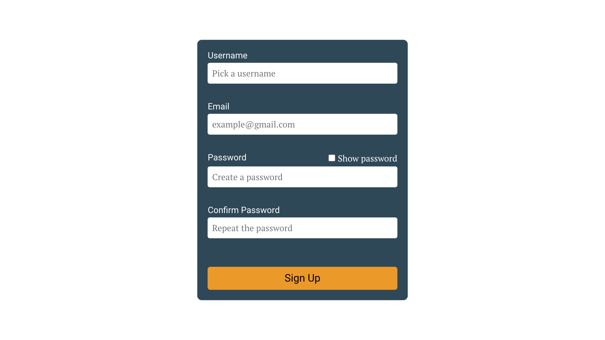

# Registration Form
[Demo](https://tbm85.github.io/demo-registration-form/)

## Description
A registration form made with React JS

This project was bootstrapped with [Create React App](https://github.com/facebook/create-react-app).

## Resources
* [PT Serif Font](https://fonts.google.com/specimen/PT+Serif)
* [Roboto Font](https://fonts.google.com/specimen/Roboto)
* [Icomoon Icons](https://icomoon.io/app/#/select)
* [i18next](https://www.i18next.com/)
* [react-i18next](https://react.i18next.com/)

## How to run this app
* Clone: `git clone https://github.com/TBM85/demo-registration-form.git`
* Enter in the directory: `cd demo-registration-form`
* Install dependencies: `npm install`
* Start the app: `npm start`

## What can this application do?
* Show error messages when input is empty or invalid
* Displays a green check icon when the input is valid
* Displays a red error icon when the input is empty or invalid
* Show password when checkbox is clicked
* Translate the page from English to Spanish and viceversa
* If all the inputs are valid you can register
* And once inside, you can log out

## License
Copyright (c) 2021 Tania Ballester. This project is using [MIT License](LICENSE.md)